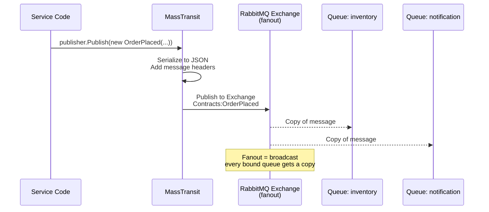
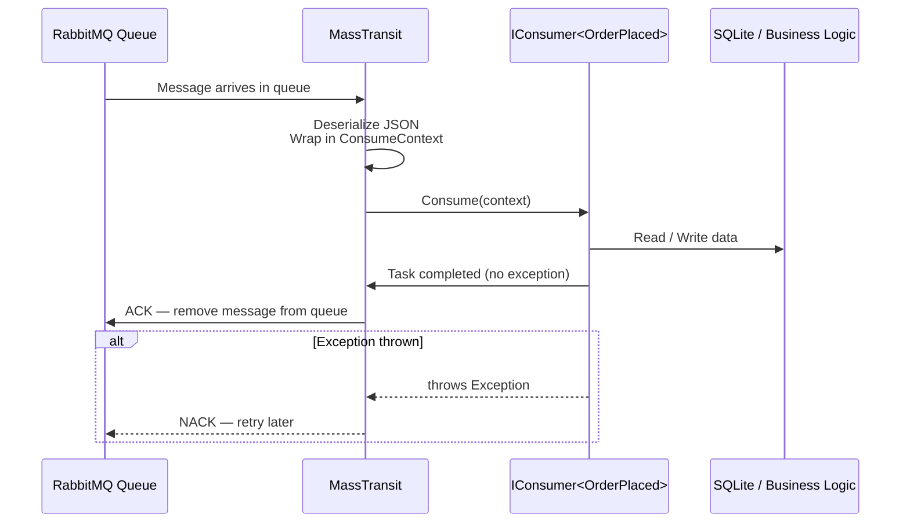
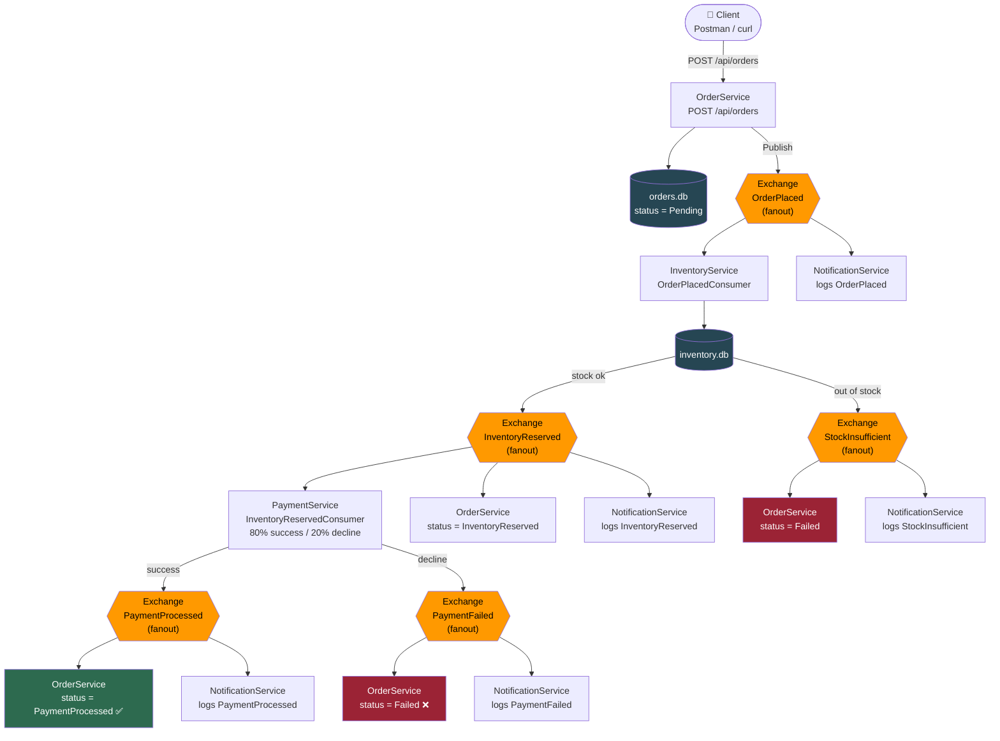
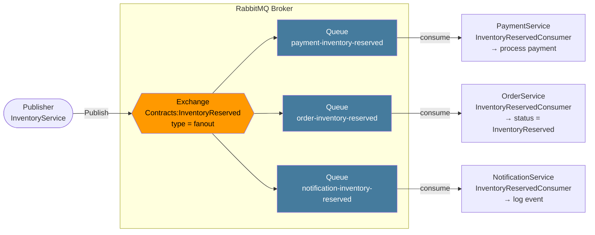
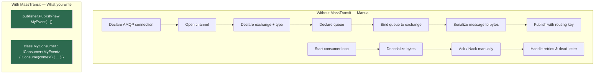

# Message Flow Diagrams

> All diagrams use **Mermaid** — rendered automatically on GitHub.

---

## 1. How a Message Gets Published to RabbitMQ

When your service calls `publisher.Publish(new OrderPlaced(...))`, here is what happens step by step:

---

## 2. How a Message Gets Consumed from RabbitMQ

Each service has its own dedicated queue. MassTransit creates it on startup and keeps polling it.

---

## 3. Full End-to-End Event Chain

This shows the complete happy path and the failure paths triggered by a single `POST /api/orders`.

---

## 4. RabbitMQ Exchange → Queue → Consumer Binding

This shows how one fanout exchange fans out to multiple service queues, and how each service independently consumes its own copy.

---

## 5. What MassTransit Handles For You

> MassTransit handles everything in the left box automatically at startup.
> You only write the two green boxes.
